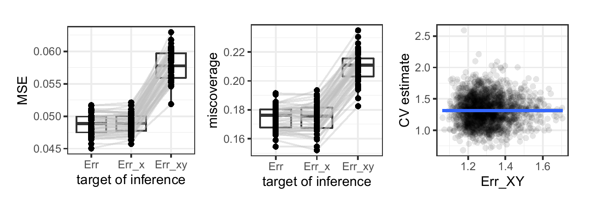
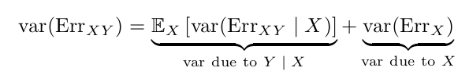
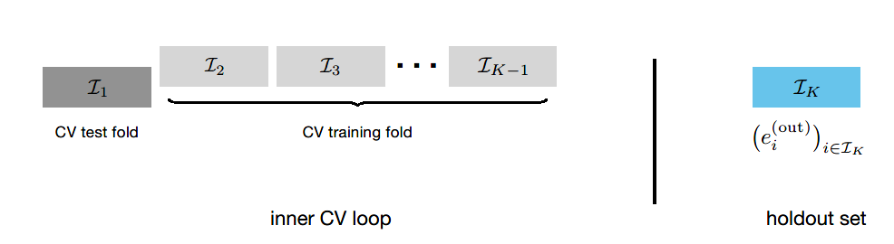

##

### Motivation

Most methods for the average causal effect require estimation of certain nuisance functions:

- probability of treatment conditional on covariates

- probability of outcome conditional on treatment and covariates

Doubly-robust estimators, e.g., augmented inverse probability weighted estimator (AIPW) and targeted maximum likelihood estimator (TMLE):

- two chances to guess the correct nuisance model

- allow for slower converging models

- limitation: nuisance models need to be simple (Donsker class). Overly narrow confidence intervals if not in this class.

**Cross-fitting allows for complex nuisance models.** Cross-fitted and doubly-robust models are compatible with a wide range of machine learning methods. 

### Double cross-fit

step 0: dataset with outcome, treatment and minimal sufficient adjustment set of confounders

step 1: partition dataset into $p$ splits

step 2: fit two nuisance models (for treatment and outcome) in each split

step 3: generate predictions using models estimated from **discordant** datasets (each nuisance model from a different split) 

step 4: point ACE ($ACE_p$) estimate obtained from the average of all predictions across splits. 

step 5: repeat above steps for a different way of splitting data. 

step 6: overall ACE ($\widetilde{ACE}$) calculated as the median of point estimates across all splits. Variance of $\widetilde{ACE}$ is as follows:

$$Var (\widetilde{ACE}) = \text{median}(Var(ACE_p) + (ACE_p - \widetilde{ACE})^2)$$
Limitations:

- long run-time due to partitioning and repetitions

- finite sample problem - especially with many splits and k-fold super learners.

## Cross-validation: what does it estimate and how well does it do it?

### Main Points:

- MSE of CV point estimate of prediction error is lower for Err and Err_x than Err_xy and has higher coverage for Err and Err_x than Err_xy

- Both Err_x and Err_xy have mean Err, and variance of Err_x is smaller than that of Err_xy 

- CV point estimate of prediction error is really an estimate of the average prediction error 

- Nested CV estimate of MSE:

