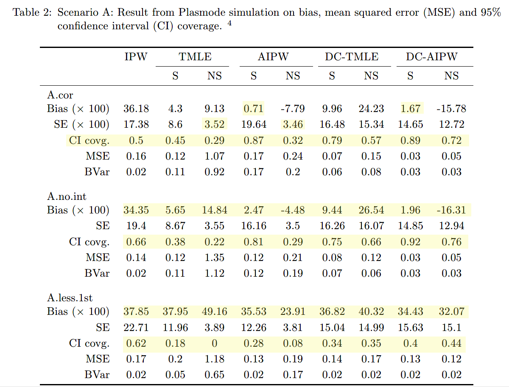
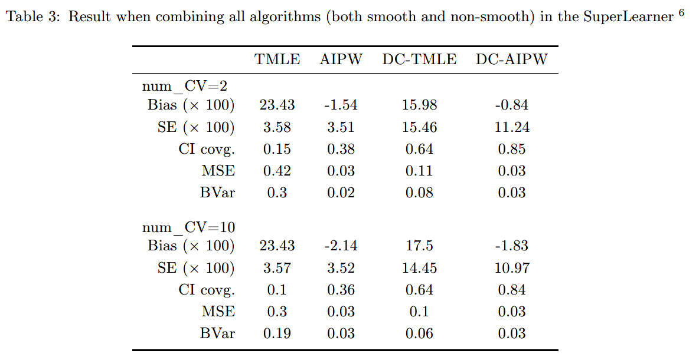
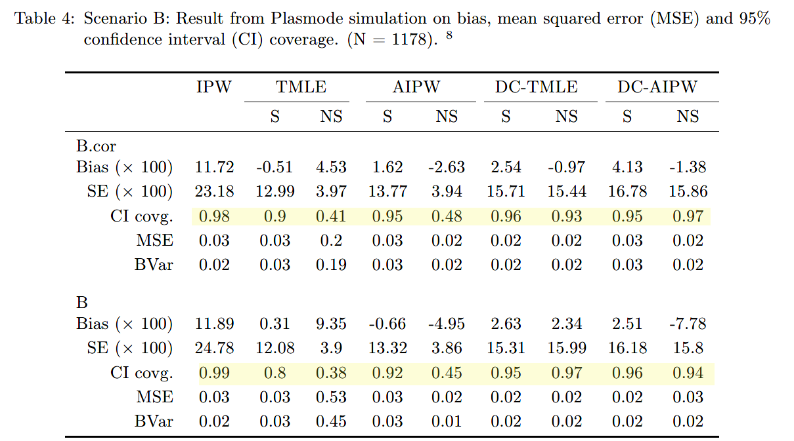
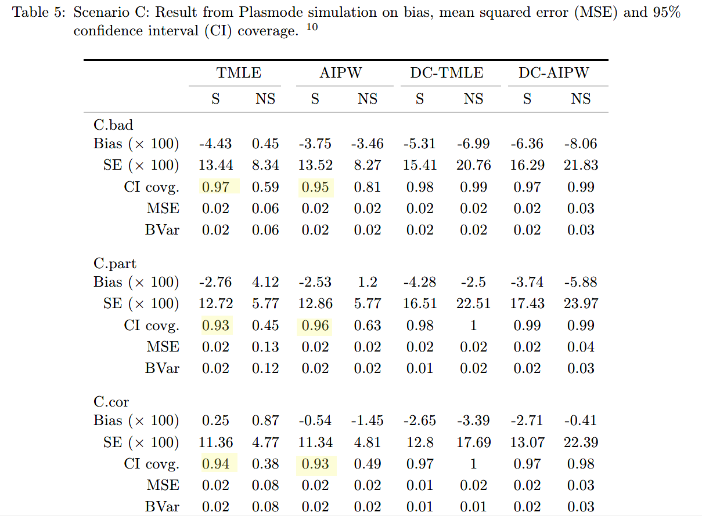

```{r setup, include=FALSE}
knitr::opts_chunk$set(echo = TRUE)
```

### Methods

Target parameter: ATE

ATE estimators:

- IPTW

- AIPW (with or without cross-fitting)

- TMLE (with or without cross-fitting)


Models for nuisance parameters (outcome & PS models):

- Cross-validated ensemble learner with smooth methods (e.g. GLM, LASSO)

- Cross-validated ensemble learner with non-smooth methods (e.g. boosting, random forest)

### Dataset

Growing Up in Singapore Towards healthy Outcomes:

- n=1178

- 331 covariates

### Simulation scenarios:
 
##### Scenario A: true model more complex than fitted model

True models:

- Outcome model: $Y \sim A + (X_1 + X_2 + X_5 + X_{18} + X_{217})^2 + \sum_{i=1}^{40} X_i$

- PS model: $\text{logit}(P(A=1|X)) \sim (X_1 + X_2 + X_5 + X_{18} + X_{217})^2 + \sum_{i=1}^{40} X_i$

Misspecified first order terms ('A.less.1st'):

- Outcome model: $Y \sim A + (X_1 + X_2 + X_5 + X_{18} + X_{217})^2 + \sum_{i\in A} X_i$

- PS model: $\text{logit}(P(A=1|X)) \sim (X_1 + X_2 + X_5 + X_{18} + X_{217})^2 + \sum_{i\in A} X_i$

Misspecified interactions terms ('A.no.int'):

- Outcome model: $Y \sim A + X_1 + X_2 + X_5 + X_{18} + X_{217} + \sum_{i=1}^{40} X_i$

- PS model: $\text{logit}(P(A=1|X)) \sim X_1 + X_2 + X_5 + X_{18} + X_{217} + \sum_{i=1}^{40} X_i$

##### Scenario B: true model simpler than fitted model

True models:

- Outcome model: $Y \sim A + (X_1 + X_2 + X_5 + X_{18} + X_{217})^2 + \sum_{i\in A} X_i$

- PS model: $\text{logit}(P(A=1|X)) \sim (X_1 + X_2 + X_5 + X_{18} + X_{217})^2 + \sum_{i\in A} X_i$

Fitted models:

- Outcome model: $Y \sim A + (X_1 + X_2 + X_5 + X_{18} + X_{217})^2 + \sum_{i=1}^{40} X_i$

- PS model: $\text{logit}(P(A=1|X)) \sim (X_1 + X_2 + X_5 + X_{18} + X_{217})^2 + \sum_{i=1}^{40} X_i$

##### Scenario C: Interaction between treatment and covariates

True models:

- Outcome model: $Y \sim  (A +X_1 + X_2 + X_5 + X_{18} + X_{217})^2$

- PS model: $\text{logit}(P(A=1|X)) \sim  (X_1 + X_2 + X_5 + X_{18} + X_{217})^2$

Partially misspecified (C.part):

- Outcome model: $Y \sim A + A:X_1 + A:X_{217} + (X_1 + X_2 + X_5 + X_{18} + X_{217})^2$

- PS model: $\text{logit}(P(A=1|X)) \sim (X_1 + X_2 + X_5 + X_{18} + X_{217})^2$

No interaction terms (C.bad):

- Outcome model: $Y \sim A + (X_1 + X_2 + X_5 + X_{18} + X_{217})^2$

- PS model: $\text{logit}(P(A=1|X)) \sim (X_1 + X_2 + X_5 + X_{18} + X_{217})^2$

### Results



- poor performance across the board

- TMLE/AIPW with non-smooth learners: poor coverage due to small SE estimates

- AIPW with smooth learners: minimal bias but sub-optimal coverage

- Omitting interactions had less of an impact than removing first order terms



- Combining smooth and non-smooth learners produced results that are the average of those with only smooth learners or non-smooth leaners

- when all 331 covariates included, double-crossfitting is preferred (coverage 85% and 95% for TMLE and AIPW)



- good coverage with smooth learners for all estimators

- IPW: poor bias and overly conservative coverage due to large SEs




- double-crossfitting: overly conservative coverage

- non-crossfit estimators with smooth learners ahd better coverage 