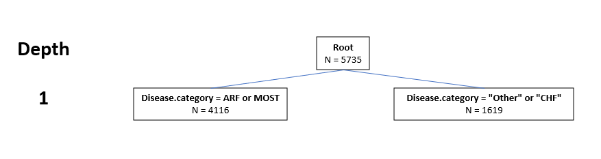
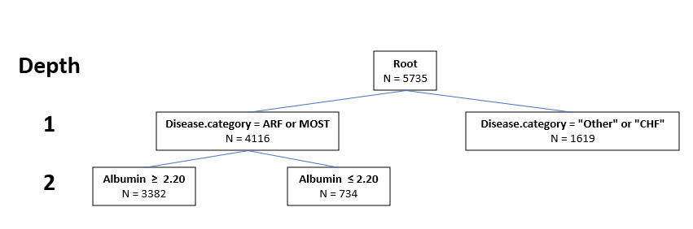
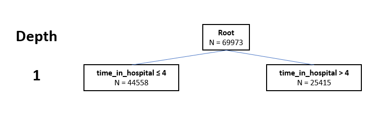
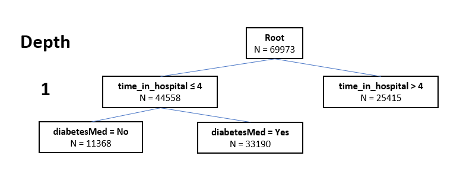

```{r}
library(stringr)
library(rpart)

setwd("~/../LX_Project/cart/tutorial2//")
```

### Introduction

Tree-based methods are often easy to understand, interpret and visualize. Unlike regression models, tree-based methods do not make distributional assumptions about the outcome and interactions amongst covariates do not need to be specified. Decision trees attempt at explaining variability in the outcome by organizing the predictors into distinct regions. This is done iteratively starting with the full dataset as the root node of the tree, from which more nodes emerge. Internal nodes are split into children nodes while splitting ceases at terminal nodes. 

This tutorial will explain basic tree-based methods for binary and continuous outcomes using real datasets and example R codes. Regression tree is used for continuous responses and classification tree is used for binary responses. The right heart catheterization (RHC) [1] and diabetes readmission [2] datasets will serve as examples to demonstrate the classification and regression tree (CART) algorithms. 

### Regression tree with the RHC study

#### Background

RHC was believed to lead to better patient outcomes by many physician. Hence the study aimed to examine the association of right heart catheterization (RHC) during the first 24 hours of care in the intensive care unit and subsequent survival, length of stay, intensity of care, and cost of care. Data on 5735 critically ill patients being treated in an intensive care unit were collected.  We will focus on length of stay, a continuous response, as the outcome of interest.

#### Data cleaning
The dataset is prepared following the steps outlined in "R Guide for TMLE in Medical Research" (https://ehsanx.github.io/TMLEworkshop/).

```{r}
rhcdata <- read.csv("rhc.csv") # load data

# add column for outcome Y: length of stay 
# Y = date of discharge - study admission date
# Y = date of death - study admission date if date of discharge not available
rhcdata$Y <- rhcdata$dschdte - rhcdata$sadmdte
rhcdata$Y[is.na(rhcdata$Y)] <- rhcdata$dthdte[is.na(rhcdata$Y)] - 
  rhcdata$sadmdte[is.na(rhcdata$Y)]
# remove outcomes we are not examining in this example
rhcdata <- dplyr::select(rhcdata, 
                         !c(dthdte, lstctdte, dschdte, death, t3d30, dth30, surv2md1))
# remove unnecessary and problematic variables 
rhcdata <- dplyr::select(rhcdata, 
                         !c(sadmdte, ptid, X, adld3p, urin1, cat2))

# convert all categorical variables to factors 
factors <- c("cat1", "ca", "cardiohx", "chfhx", "dementhx", "psychhx", 
             "chrpulhx", "renalhx", "liverhx", "gibledhx", "malighx", 
             "immunhx", "transhx", "amihx", "sex", "dnr1", "ninsclas", 
             "resp", "card", "neuro", "gastr", "renal", "meta", "hema", 
             "seps", "trauma", "ortho", "race", "income")
rhcdata[factors] <- lapply(rhcdata[factors], as.factor)
# convert our treatment A (RHC vs. No RHC) to a binary variable
rhcdata$A <- ifelse(rhcdata$swang1 == "RHC", 1, 0)
rhcdata <- dplyr::select(rhcdata, !swang1)
# Categorize the variables to match with the original paper
rhcdata$age <- cut(rhcdata$age,breaks=c(-Inf, 50, 60, 70, 80, Inf),right=FALSE)
rhcdata$race <- factor(rhcdata$race, levels=c("white","black","other"))
rhcdata$sex <- as.factor(rhcdata$sex)
rhcdata$sex <- relevel(rhcdata$sex, ref = "Male")
rhcdata$cat1 <- as.factor(rhcdata$cat1)
levels(rhcdata$cat1) <- c("ARF","CHF","Other","Other","Other",
                          "Other","Other","MOSF","MOSF")
rhcdata$ca <- as.factor(rhcdata$ca)
levels(rhcdata$ca) <- c("Metastatic","None","Localized (Yes)")
rhcdata$ca <- factor(rhcdata$ca, levels=c("None",
                                          "Localized (Yes)","Metastatic"))

# Rename variables
names(rhcdata) <- c("Disease.category", "Cancer", "Cardiovascular", 
                    "Congestive.HF", "Dementia", "Psychiatric", "Pulmonary", 
                    "Renal", "Hepatic", "GI.Bleed", "Tumor", 
                    "Immunosupperssion", "Transfer.hx", "MI", "age", "sex", 
                    "edu", "DASIndex", "APACHE.score", "Glasgow.Coma.Score", 
                    "blood.pressure", "WBC", "Heart.rate", "Respiratory.rate", 
                    "Temperature", "PaO2vs.FIO2", "Albumin", "Hematocrit", 
                    "Bilirubin", "Creatinine", "Sodium", "Potassium", "PaCo2", 
                    "PH", "Weight", "DNR.status", "Insurance", 
                    "Respiratory.Diag", "Cardiovascular.Diag", 
                    "Neurological.Diag", "Gastrointestinal.Diag", "Renal.Diag",
                    "Metabolic.Diag", "Hematologic.Diag", "Sepsis.Diag", 
                    "Trauma.Diag", "Orthopedic.Diag", "race", "income", 
                    "Y", "A")

levels(rhcdata$Insurance) = c("Medicaid", "Medicare", "M&M", "None", "Priv", "Priv&Medicare")
```

The dataset contains 5735 entries and 17 variables. 
```{r}
dim(rhcdata)
```

#### Step by step breakdown of the algorithm

1. Set root of the tree as the full dataset

We define the response variable as 'Y' and the dataset as 'rhcdata'. 

```{r}
  resp = "Y"; data = rhcdata
```

Create a data frame to store the results: 'status' describes the nature of the node, 'count' shows the number of observations in the node, 'iter' reports the tree's depth, 'mean' is simply the average of the response within the node. 

```{r}
  output = data.frame(status = "split", count = nrow(data), "split rule" = "root", depth = 0, mean = mean(data[, resp]), stringsAsFactors = FALSE)
```

2. For each node that should be split further, determine the optimal split rule.

- First identify which nodes are labeled "split". As of now there is only the root:
```{r}
which(output$status == "split")
```

Since the outcome is a continuous variable, we. To determine the splitting rule, determine which covariate leads to the lowest SSE overall.

  $$ SSE = \sum_k \sum_i (Y_{ik} - \bar{Y}_k)^2$$
  
  , where $Y_{ik}$ is the $i^\text{th}$ observation of the $k^\text{th}$ split of the variable. 

To demonstrate the process, let's focus on three different types of covariate: continuous ('Albumin'), binary ('Cardiovascular') and categorical ('Disease.category'). 

A continuous variable can take on an infinite number of values within the range allowed. 'Albumin' has 57 unique values:

```{r}
length(unique(data$Albumin))
```

There are 57 - 1 = 56 different ways to split the data into two parts. For each split, compute the SSE:

```{r}
sse_cont = c() # empty vector for storing values of sse
for(i in sort(unique(data$Albumin))[-57]){
  # compute sse for the ith split:
  sse_i = sum( (data[data$Albumin <= i, resp] - mean(data[data$Albumin <= i, resp]) )^2 ) + 
    sum( (data[data$Albumin > i, resp] - mean(data[data$Albumin > i, resp]) )^2 ) 
  sse_cont = c(sse_cont, sse_i)
}
sse_cont
```

The smallest sse is:

```{r}
min_cont = min(sse_cont)
min_cont
```

It corresponds to the following cutoff value:

```{r}
sort(unique(data$Albumin))[which.min(sse_cont)]
```

Binary variables take on one of two possible values or levels. As such, there is only one way to split the data with binary variables. 'Cardiovascular' has levels '0' and '1':

```{r}
levels(data$Cardiovascular)
```

The sse can be computed by splitting the data by the two levels:
```{r}
min_bin = sum( (data[data$Cardiovascular == 0, resp] - mean(data[data$Cardiovascular == 0, resp]) )^2 ) + 
  sum( (data[data$Cardiovascular == 1, resp] - mean(data[data$Cardiovascular == 1, resp]) )^2 )
min_bin
```

Some factors can take on one of more than two possible levels. 'Disease.category' has four levels in total:

```{r}
levels(data$Disease.category)
```

With N levels, there are a total of $2^{N-1} - 1$ ways of doing binary splits. We can use a simple loop to generate a list of unique combinations of levels that can be used for splits:

```{r}
# find all possible binary splits
kk = 1
varcomb = list()
for (ii in 1:length(levels(data$Disease.category))) {
  comb = combn(length(levels(data$Disease.category)), ii)
  for (jj in 1:ncol(comb)){
    varcomb[[kk]] = levels(data$Disease.category)[comb[, jj]]
    kk = kk +1
  }
}
varcomb
```

Using the above list, compute the sse for all possible splits:

```{r}
sse_cat = sapply(varcomb, function(varcomb_i){ 
              sum((data[data$Disease.category %in% varcomb_i, resp] - mean(data[data$Disease.category %in% varcomb_i, resp]))^2) + sum((data[!(data$Disease.category %in% varcomb_i), resp] - mean(data[!(data$Disease.category %in% varcomb_i), resp]))^2) })
sse_cat
```

The smallest sse is:

```{r}
min_cat = min(sse_cat)
min_cat
```

It corresponds to the following combination: 
```{r}
varcomb[[which.min(sse_cat)]]
```

The above combination refers to the split where the entries with levels "ARF" and "MOSF" belong to one group and entries with the other two levels ("Other" and "CHF") belong to another group.

Now determine which of the three covariates leads to the smallest SSE overall, which is 'Disease.category':
```{r}
min(min_cont, min_bin, min_cat)
```

3. Split the dataset according to the split rule determined in the prior step.

The first children node contains all those entries with disease category "ARF" or "MOSF". 

```{r}
children = list() # empty lists
children[[1]] = data[(data[["Disease.category"]] %in% c("ARF", "MOSF")), ]
```

The other node contains all those entries with a disease category that is neither "ARF" nor "MOSF".

```{r}
children[[2]] = data[!(data[["Disease.category"]] %in% c("ARF", "MOSF")), ]
```

4. Determine if the children nodes are ‘leaves’ or nodes that need to be split further. 

Set children nodes to 'leaves' if (1) they contain too few observations (below a pre-specified minimum terminal node size) and/or (2) all observations have the same label.

Large terminal node sizes lead to shallow trees with less variance but those are at a higher of bias. On the other hand, terminal node sizes that are too small lead to large trees where predictions have high variance that may not be reliable. For simplicity, we will set the minimum node size to be 4000 to grow a basic tree. 

The first node should be split further while the second node is a 'leaf':

```{r}
# set the minimum node size:
min.obs = 4000

if (nrow(children[[1]]) < min.obs | nrow( unique(children[[1]][, -which(names(children[[1]]) %in% resp)]) ) == 1) status1 = "leaf" else status1 = "split" 
          
status1

if (nrow(children[[2]]) < min.obs | nrow( unique(children[[2]][, -which(names(children[[2]]) %in% resp)]) ) == 1) status2 = "leaf" else status2 = "split" 
          
status2
```

Update the object 'output' with the two new nodes:

```{r}
# descriptions for the children nodes:
newOutput = data.frame(status = c(status1, status2), count = sapply(children, nrow), "split rule" = c(paste("Disease.category", "=", paste("Other", "CHF", collapse = ",")), paste("Disease.category", "=", paste("ARF", "MOST", collapse = ",")) ), depth = 1, row.names = NULL, mean = sapply(children, function(x){mean(x[[resp]])}))
        
# add to the existing output
output = rbind(output, newOutput)
output
```

The following diagram illustrates the tree described in the output above:




5. repeat 2-4 until each node is either ‘root’, ‘parent’, or ‘leaf’

Start with the left node where disease category is one of "ARF" and "MOST", following the same steps outlined above. First with the continuous variable 'Albumin':

```{r}
data = children[[1]] # set node as temporary data 

length(unique(data$Albumin)) # 53 total unique values

sse_cont = c() # empty vector for storing values of sse
for(i in sort(unique(data$Albumin))[-53]){
  # compute sse for the ith split:
  sse_i = sum( (data[data$Albumin <= i, resp] - mean(data[data$Albumin <= i, resp]) )^2 ) + 
    sum( (data[data$Albumin > i, resp] - mean(data[data$Albumin > i, resp]) )^2 ) 
  sse_cont = c(sse_cont, sse_i)
}

min_cont = min(sse_cont)
min_cont
```

Then the binary variable 'Cardiovascular':

```{r}
min_bin = sum( (data[data$Cardiovascular == 0, resp] - mean(data[data$Cardiovascular == 0, resp]) )^2 ) + 
  sum( (data[data$Cardiovascular == 1, resp] - mean(data[data$Cardiovascular == 1, resp]) )^2 )
min_bin
```

And the categorical variable 'Disease.category':

```{r}
# first build list of all possible ways of splitting the four categories
kk = 1
varcomb = list()
for (ii in 1:length(levels(data$Disease.category))) {
  comb = combn(length(levels(data$Disease.category)), ii)
  for (jj in 1:ncol(comb)){
    varcomb[[kk]] = levels(data$Disease.category)[comb[, jj]]
    kk = kk +1
  }
}
varcomb

# then calculate sse for each split
sse_cat = sapply(varcomb, function(varcomb_i){ 
  sum((data[data$Disease.category %in% varcomb_i, resp] - mean(data[data$Disease.category %in% varcomb_i, resp]))^2) + sum((data[!(data$Disease.category %in% varcomb_i), resp] - mean(data[!(data$Disease.category %in% varcomb_i), resp]))^2) })

min_cat = min(sse_cat)
min_cat
```

The smallest sse is:

```{r}
min(min_cont, min_bin, min_cat)
```

It corresponds to the variable 'Albumin' with the following split value:

```{r}
split_value = sort(unique(data$Albumin))[which.min(sse_cont)]
split_value
```

Now split the data accordingly. The first child node consists of observations with 'Albumin' values that are less or equal to 2.199707.

```{r}
children = list() # empty lists
children[[1]] = data[(data[["Albumin"]] <= split_value), ]
```

The other child node consists of observations with 'Albumin' values that are greater than 2.199707.

```{r}
children[[2]] = data[(data[["Albumin"]] > split_value), ]
```

Now let's examine the children nodes. Both nodes are leaves as they do not meet the requirement of having at least 4000 observations:

```{r}
min.obs = 4000 # set the minimum node size

if (nrow(children[[1]]) < min.obs | nrow( unique(children[[1]][, -which(names(children[[1]]) %in% resp)]) ) == 1) status1 = "leaf" else status1 = "split" 
          
status1

if (nrow(children[[2]]) < min.obs | nrow( unique(children[[2]][, -which(names(children[[2]]) %in% resp)]) ) == 1) status2 = "leaf" else status2 = "split" 
          
status2
```

Update the object 'output' with the new split:

```{r}
# descriptions for the children nodes:
newOutput = data.frame(status = c(status1, status2), count = sapply(children, nrow), "split rule" = c(paste("Albumin", "<=", 2.20), paste("Albumin", ">", 2.20) ), depth = 2, row.names = NULL, mean = sapply(children, function(x){mean(x[[resp]])}))
        
# add to the existing output
output = rbind(output, newOutput)
output
```

The above tree can be visualized by the following diagram:



#### Summary of the steps:

1. Set root of the tree as the full dataset

2. For each node that can be split further, determine the optimal split rule

3. Split the dataset accordingly

4. Determine if they are ‘leaves’ or need to be split further

5. repeat 2-4 until each node is either ‘root’, ‘parent’, or ‘leaf’

#### Comparison with existing software

We can compare the results above against outputs from an existing R package 'rpart'. 

For consistency, we set the mininum node size ('minsplit') to 4000 and the minimum leaf size ('minbucket') to 1 (since we didn't set a restriction on it). We further set the complexity parameter 'cp' to -1 so that there will be no pruning.

```{r}
library(rpart)
rpart(Y ~ Cardiovascular + Albumin + Disease.category, data = rhcdata, minsplit = 4000, minbucket = 1, cp=-1)
```

Note that the split value for 'Albumin' is different from the one we used above. However, the resulting children nodes have the same number of observations as we saw.
This is because the split value from 'rpart' is the average of two adajcent unique values. To show this, we find the unique value adjacent to 2.199707:

```{r}
sort(unique(data$Albumin))[which.min(sse_cont) + 1]
```

Take the average:

```{r}
(2.199707 + 2.299805) / 2
```

We end up with the same value as reported by 'rpart'

## Classification tree with diabetes readmission

#### Background

It is believed that diabetic care (e.g. testing for blood glucose levels) during hospitalization has an impact on patient outcomes. Strack B. et al. explored the relationship between hospital readmission and HbA1c measurements in hopitalized patients diagnosed with diabetes. Data were extracted from a national database (Health Facts) from 1999 to 2008. 

#### Data cleaning 

Prepare the data according to the same steps outlined in Strack B. et al.

```{r}
drdata = read.csv("diabetic_data.csv", stringsAsFactors = TRUE) # load data

## exclusions
# 1. only keep first obs from the same patient (with the same unique_id)
unique_id = sapply(unique(drdata$patient_nbr), FUN = function(x){
  which(drdata$patient_nbr == x)[1]
})
drdata = drdata[unique_id, ]

# delete encounter_id now
drdata$encounter_id <- NULL

# 2. remove patients that entered hospice or passed away after discharge
drdata = drdata[ -which(drdata$discharge_disposition_id %in% c(11, 13, 14, 19, 20, 21)), ]

## check missing data:
apply(drdata, MARGIN = 2, FUN = function(x){length(which(x == "?"))})
# 'medical_specialty', 'weight' and 'payer_code' have lots of missing data

## remove the variables 'weight' and 'payer_code'
drdata$weight <- NULL
drdata$payer_code <- NULL
```

```{r}
# re-coding some of the variables:
drdata$readmitted = as.factor(ifelse(drdata$readmitted == "<30", "YES", "NO"))
drdata$A1Cresult = as.factor(ifelse(drdata$A1Cresult %in% c("Norm", ">7"), "Normal", ifelse(drdata$A1Cresult == "None", "None", ifelse(drdata$change == "Ch", "high_ch", "high_noch"))))
drdata$discharge_disposition_id = as.factor(ifelse(drdata$discharge_disposition_id == 1, "Home", "Other"))
drdata$admission_source_id = as.factor(ifelse(drdata$admission_source_id == 7, "Emergency", ifelse(drdata$admission_source_id %in% c(1,2), "Referral", "Other")))

drdata$medical_specialty <- replace(drdata$medical_specialty, drdata$medical_specialty == "Cardiology-Pediatric", "Cardiology")
drdata$medical_specialty <- replace(drdata$medical_specialty, drdata$medical_specialty == "Surgeon", "SurgicalSpecialty")
drdata$medical_specialty <- replace(drdata$medical_specialty, drdata$medical_specialty == "Surgery-Cardiovascular/Thoracic", "SurgicalSpecialty")
drdata$medical_specialty <- replace(drdata$medical_specialty, drdata$medical_specialty == "Surgery-Colon&Rectal", "SurgicalSpecialty")
drdata$medical_specialty <- replace(drdata$medical_specialty, drdata$medical_specialty == "Surgery-General", "SurgicalSpecialty")
drdata$medical_specialty <- replace(drdata$medical_specialty, drdata$medical_specialty == "Surgery-Maxillofacial", "SurgicalSpecialty")
drdata$medical_specialty <- replace(drdata$medical_specialty, drdata$medical_specialty == "Surgery-Neuro", "SurgicalSpecialty")
drdata$medical_specialty <- replace(drdata$medical_specialty, drdata$medical_specialty == "Surgery-Pediatric", "SurgicalSpecialty")
drdata$medical_specialty <- replace(drdata$medical_specialty, drdata$medical_specialty == "Surgery-Plastic", "SurgicalSpecialty")
drdata$medical_specialty <- replace(drdata$medical_specialty, drdata$medical_specialty == "Surgery-PlasticwithinHeadandNeck", "SurgicalSpecialty")
drdata$medical_specialty <- replace(drdata$medical_specialty, drdata$medical_specialty == "Surgery-Thoracic", "SurgicalSpecialty")
drdata$medical_specialty <- replace(drdata$medical_specialty, drdata$medical_specialty == "Surgery-Vascular", "SurgicalSpecialty")
drdata$medical_specialty <- str_replace(drdata$medical_specialty, "SurgicalSpecialty", "Surgery")
drdata$medical_specialty[which(drdata$medical_specialty == "?")] = "Missing or Unknown" 
drdata$medical_specialty[which(!(drdata$medical_specialty %in% c("InternalMedicine", "Cardiology", "Surgery", "Family/GeneralPractice", "Missing or Unknown")))] = "Other" 
diag_diabetes = levels(drdata$diag_1)[which(substr(levels(drdata$diag_1), 1, 3)==250)]
diag_other = levels(drdata$diag_1)[which(!(levels(drdata$diag_1) %in% c(390:459, 785, diag_diabetes, 460:519, 786, 520:579, 787, 800:999, 710:739, 580:629, 788, 140:239)))]
levels(drdata$diag_1) <- list(
  "Circulatory" = c(390:459, 785), 
  "Diabetes" = diag_diabetes, 
  "Respiratory" = c(460:519, 786), 
  "Digestive" = c(520:579, 787),
  "Injury and poisoning" = c(800:999),
  "Musculoskeletal" = c(710:739),
  "Genitourinary" = c(580:629, 788),
  "Neoplasms" = c(140:239),
  "Other" = diag_other
  )

levels(drdata$race) = list("Missing" = "?", "Other" = c("Other", "Asian", "Hispanic"), "AfricanAmerican" = "AfricanAmerican", "Caucasian" = "Caucasian" )

drdata$age_num = drdata$age
levels(drdata$age_num) = list("5" = "[0-10)", "15" = "[10-20)", "25" = "[20-30)", "35" = "[30-40)", "45" = "[40-50)", "55" = "[50-60)", "65" = "[60-70)", "75" = "[70-80)", "85" = "[80-90)", "95" = "[90-100)")

drdata$age_num = as.numeric(as.character(drdata$age_num))

levels(drdata$age) = list("<30" = c("[0-10)", "[10-20)", "[20-30)" ), "[30,60)" = c("[30-40)", "[40-50)", "[50-60)"), "[60,100)" = c("[60-70)", "[70-80)", "[80-90)", "[90-100)"))

drdata$medical_specialty <- as.factor(drdata$medical_specialty)
drdata$medical_specialty <-droplevels(drdata$medical_specialty)

# change the baseline level for some factors:
drdata$race = relevel(drdata$race, ref = "AfricanAmerican")

drdata$age = relevel(drdata$age, ref = "[30,60)") 

drdata$diag_1 = relevel(drdata$diag_1, ref = "Diabetes") 

drdata$A1Cresult =  relevel(drdata$A1Cresult, ref = "None") 
```

The dataset contains 69973 entries and 48 variables.
```{r}
dim(drdata)
```

#### Classification vs. regression trees

The steps for building a classification tree are identical to those outlined above for a regression tree, with the exception of how the splits are done. Rather than computing the SSE, Gini index is used as a measure of dispersion for a binary outcome. The feature leading to the lowest Gini index is selected. The Gini index for a feature is calculated by subtracting from 1 the sum of square proportions:
  
  $$ Gini_k = 1 - (p_k ^ 2 + (1 - p_k) ^ 2) $$
  
  , where $p_k$ is the proportion of the outcome for the $k^\text{th}$ split of the feature.
  
  Then the weighted sum of Gini indices is computed:
  
  $$ \sum_k \frac{n_k}{N} Gini_k$$
  
  , where $n_k$ is the size of the $k^\text{th}$ split of the feature, and $N$ is the total sample size.
  

#### Step by step breakdown of the algorithm

1. Set root of the tree as the full dataset

We define the response variable as 'readmitted' and the dataset as 'drdata'. 

```{r}
resp = "readmitted"; data = drdata
```

Create a data frame to store the results: 'status' describes the nature of the node, 'count' shows the number of observations in the node, 'iter' reports the tree's depth, 'rate' is rate of readmission. 

```{r}
output = data.frame(status = "split", count = nrow(data), "split rule" = "root", depth = 0, rate = mean(data[, resp] == "YES"), stringsAsFactors = FALSE)
```

2. For each node that should be split further, determine the optimal split rule.

- First identify which nodes are labeled "split". As of now there is only the root:
```{r}
which(output$status == "split")
```

Readmission is a binary variable, so we compute the Gini criterion for each covariate. Again for demonstration purposes we only consider three different types of covariate: continuous ('time_in_hospital'), binary ('diabetesMed') and categorical ('A1Cresult'). 

'time_in_hospital' has 14 unique values:

```{r}
length(unique(data$time_in_hospital))
```

There are 14 - 1 = 13 different ways to split the data into two parts. For each split, compute the Gini criterion:

```{r}
gini_cont = c() # empty vector for storing values of gini
for(i in sort(unique(data$time_in_hospital))[-14]){
  # compute gini for the ith split:
  data.list = list()
  data.list[[1]] = data[which(data[, "time_in_hospital"] <= i), c("time_in_hospital", resp)]
  data.list[[2]] = data[which(data[, "time_in_hospital"] > i), c("time_in_hospital", resp)]
  gini_i = sum(sapply(data.list, function(x){
            count = c(sum(x[[resp]]  == "NO"), sum(x[[resp]]  == "YES"))
            gini = 1 - sum((count / sum(count)) ^ 2)
            gini * sum(count)
          }) / nrow(data))
  gini_cont = c(gini_cont, gini_i)
}
gini_cont
```

The smallest gini criterion across all possible splits is:

```{r}
min_cont = min(gini_cont)
min_cont
```

It corresponds to the following cutoff value:

```{r}
sort(unique(data$time_in_hospital))[which.min(gini_cont)]
```

'diabetesMed' has levels 'No' and 'Yes':

```{r}
levels(data$diabetesMed)
```

The gini criterion can be computed by splitting the data by the two levels:
```{r}
data.list = split(data[, c(resp, "diabetesMed")], data[, "diabetesMed"])
gini_bin = sum(sapply(data.list, function(x){
            count = table(x)
            gini = 1 - sum((count / sum(count)) ^ 2)
            gini * sum(count)
          }) / nrow(data))
gini_bin
```

Some factors can take on one of more than two possible levels. 'A1Cresult' has four levels in total:

```{r}
levels(data$A1Cresult)
```

With N levels, there are a total of $2^{N-1} - 1$ ways of doing binary splits. We can use a simple loop to generate a list of unique combinations of levels that can be used for splits:

```{r}
# find all possible binary splits
kk = 1
varcomb = list()
for (ii in 1:length(levels(data$A1Cresult))) {
  comb = combn(length(levels(data$A1Cresult)), ii)
  for (jj in 1:ncol(comb)){
    varcomb[[kk]] = levels(data$A1Cresult)[comb[, jj]]
    kk = kk +1
  }
}
varcomb
```

Using the above list, compute the gini criterion for all possible splits:

```{r}
gini_cat = sapply(varcomb, function(varcomb_i){ 
  data.list = list()
  data.list[[1]] = data[which(data[, "A1Cresult"] %in% varcomb_i), c("A1Cresult", resp)]
  data.list[[2]] = data[which(!(data[, "A1Cresult"] %in% varcomb_i)), c("A1Cresult", resp)]
  gini = sum(sapply(data.list, function(x){
            count = c(sum(x[[resp]]  == "NO"), sum(x[[resp]]  == "YES"))
            gini = 1 - sum((count / sum(count)) ^ 2)
            gini * sum(count)
          }) / nrow(data))
  gini
  })
gini_cat
```

The smallest gini is:

```{r}
min_cat = min(gini_cat, na.rm = TRUE)
min_cat
```

It corresponds to the following combination: 
```{r}
varcomb[[which.min(gini_cat)]]
```

The above combination refers to the split where the entries with level "high_noch" belong to one group and entries with one of the other three levels ('high_ch', 'None' and 'Normal') belong to another group.

Now determine which of the three covariates leads to the smallest gini criterion overall, which is 'time_in_hospital':
```{r}
min(min_cont, gini_bin, min_cat)
```

3. Split the dataset according to the split rule determined in the prior step.

The first children node contains all those entries where 'time_in_hospital' is less than or equal to 4.

```{r}
children = list() # empty lists
children[[1]] = data[data[["time_in_hospital"]] <= 4, ]
```

The other node contains all those entries where 'time_in_hospital' is greater than 4.

```{r}
children[[2]] = data[data[["time_in_hospital"]] > 4, ]
```

4. Determine if the children nodes are ‘leaves’ or nodes that need to be split further. 

Set children nodes to 'leaves' if (1) they contain too few observations (below a pre-specified minimum terminal node size) and/or (2) all observations have the same label. For simplicity, we will set the minimum node size to 40000, since the dataset is fairly large.

The first node should be split further while the second node is a 'leaf':

```{r}
# set the minimum node size:
min.obs = 40000

if (nrow(children[[1]]) < min.obs | nrow( unique(children[[1]][, -which(names(children[[1]]) %in% resp)]) ) == 1) status1 = "leaf" else status1 = "split" 
          
status1

if (nrow(children[[2]]) < min.obs | nrow( unique(children[[2]][, -which(names(children[[2]]) %in% resp)]) ) == 1) status2 = "leaf" else status2 = "split" 
          
status2
```

Update the object 'output' with the two new nodes:

```{r}
# descriptions for the children nodes:
newOutput = data.frame(status = c(status1, status2), count = sapply(children, nrow), "split rule" = c(paste("time_in_hospital", "<=", 4), paste("time_in_hospital", ">", 4) ), depth = 1, row.names = NULL, rate = sapply(children, function(x){mean(x[[resp]] == "YES")}))
        
# add to the existing output
output = rbind(output, newOutput)
output
```

The following diagram illustrates the tree described in the output above:




5. repeat 2-4 until each node is either ‘root’, ‘parent’, or ‘leaf’

Start with the left node where 'time_in_hospital' is less than or equal to 4 and repeat the steps above. First with the continuous variable 'time_in_hospital':

```{r}
data = children[[1]] # set node as temporary data 

length(unique(data$time_in_hospital)) # 4 unique values

gini_cont = c() # empty vector for storing values of gini

for(i in sort(unique(data$time_in_hospital))[-4]){
  # compute gini for the ith split:
  data.list = list()
  data.list[[1]] = data[which(data[, "time_in_hospital"] <= i), c("time_in_hospital", resp)]
  data.list[[2]] = data[which(data[, "time_in_hospital"] > i), c("time_in_hospital", resp)]
  gini_i = sum(sapply(data.list, function(x){
            count = c(sum(x[[resp]]  == "NO"), sum(x[[resp]]  == "YES"))
            gini = 1 - sum((count / sum(count)) ^ 2)
            gini * sum(count)
          }) / nrow(data))
  gini_cont = c(gini_cont, gini_i)
}
gini_cont

min_cont = min(gini_cont)
min_cont
```

Then the binary variable 'diabetesMed':

```{r}
data.list = split(data[, c(resp, "diabetesMed")], data[, "diabetesMed"])
gini_bin = sum(sapply(data.list, function(x){
  count = table(x)
  gini = 1 - sum((count / sum(count)) ^ 2)
  gini * sum(count)
}) / nrow(data))
gini_bin
```

And the categorical variable 'Disease.category':

```{r}
# first build list of all possible ways of splitting the four categories
kk = 1
varcomb = list()
for (ii in 1:length(levels(data$A1Cresult))) {
  comb = combn(length(levels(data$A1Cresult)), ii)
  for (jj in 1:ncol(comb)){
    varcomb[[kk]] = levels(data$A1Cresult)[comb[, jj]]
    kk = kk +1
  }
}
varcomb

# then calculate gini for each split
gini_cat = sapply(varcomb, function(varcomb_i){ 
  data.list = list()
  data.list[[1]] = data[which(data[, "A1Cresult"] %in% varcomb_i), c("A1Cresult", resp)]
  data.list[[2]] = data[which(!(data[, "A1Cresult"] %in% varcomb_i)), c("A1Cresult", resp)]
  gini = sum(sapply(data.list, function(x){
    count = c(sum(x[[resp]]  == "NO"), sum(x[[resp]]  == "YES"))
    gini = 1 - sum((count / sum(count)) ^ 2)
    gini * sum(count)
  }) / nrow(data))
  gini
})
gini_cat

# find the minimum gini criterion across all splits
min_cat = min(gini_cat, na.rm = TRUE)
min_cat
```

The smallest gini is:

```{r}
min(min_cont, gini_bin, min_cat)
```

It corresponds to the binary variable 'diabetesMed'.

Now split the data accordingly. The first child node consists of observations with the level 'No' for 'diabetesMed'.

```{r}
children = list() # empty lists
children[[1]] = data[data[["diabetesMed"]] == "No", ]
```

The other child node consists of observations with 'Albumin' values that are greater than 2.199707.

```{r}
children[[2]] = data[data[["diabetesMed"]] == "Yes", ]
```

Now let's examine the children nodes. Both nodes are leaves as they do not meet the requirement of having at least 40000 observations:

```{r}
min.obs = 40000 # set the minimum node size

if (nrow(children[[1]]) < min.obs | nrow( unique(children[[1]][, -which(names(children[[1]]) %in% resp)]) ) == 1) status1 = "leaf" else status1 = "split" 
          
status1

if (nrow(children[[2]]) < min.obs | nrow( unique(children[[2]][, -which(names(children[[2]]) %in% resp)]) ) == 1) status2 = "leaf" else status2 = "split" 
          
status2
```

Update the object 'output' with the new split:

```{r}
# descriptions for the children nodes:
newOutput = data.frame(status = c(status1, status2), count = sapply(children, nrow), "split rule" = c(paste("diabetesMed", "=", "No"), paste("diabetesMed", "=", "Yes") ), depth = 2, row.names = NULL, rate = sapply(children, function(x){mean(x[[resp]] == "YES")}))
        
# add to the existing output
output = rbind(output, newOutput)
output
```

The above tree can be visualized by the following diagram:




#### Comparison with existing software

We can compare the results above against outputs from an existing R package 'rpart'. 

```{r}
library(rpart)
rpart(readmitted ~ A1Cresult + diabetesMed + time_in_hospital, data = drdata, minsplit = 40000, minbucket = 1, cp=-1)
```

Again, note that the split value for 'time_in_hospital' is different from what we obtained previously, due to the way 'rpart' handles continuous covariates.  


### Recap

The steps for basic CART are summarized below. 

1. Set root of the tree as the full dataset

2. For each node that can be split further, determine the optimal split rule

3. Split the dataset accordingly

4. Determine if the children nodes are ‘leaves’ or need to be split further

5. repeat 2-4 until each node is either a parent node or a leaf/terminal node


### References

[1] Connors AF Jr, Speroff T, Dawson NV, Thomas C, Harrell FE Jr, Wagner D, Desbiens N, Goldman L, Wu AW, Califf RM, Fulkerson WJ Jr, Vidaillet H, Broste S, Bellamy P, Lynn J, Knaus WA. The effectiveness of right heart catheterization in the initial care of critically ill patients. SUPPORT Investigators. JAMA. 1996 Sep 18;276(11):889-97. doi: 10.1001/jama.276.11.889. 

[2] Beata S, Jonathan PD, Chris G, Juan LO, Sebastian V, Krzysztof JC, John NC, "Impact of HbA1c Measurement on Hospital Readmission Rates: Analysis of 70,000 Clinical Database Patient Records", BioMed Research International, vol. 2014, Article ID 781670, 11 pages, 2014. https://doi.org/10.1155/2014/781670